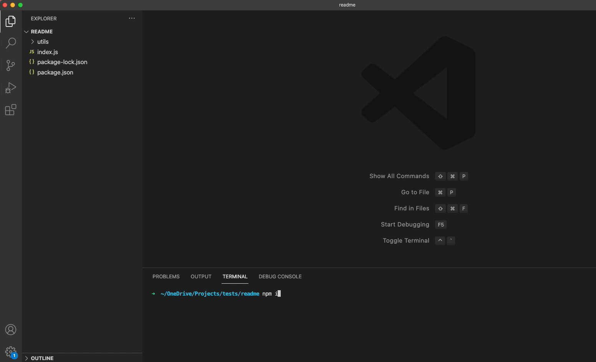

# Readme Generator
  
  
  
  ## Table of Contents
  - [Description](#description)
  - [Installation](#installation)
  - [Usage](#usage)
  - [Contributing](#contributing)
  - [Tests](#tests)
  - [Questions](#questions)
  - [Credits](#credits)
  - [License](#license)
  
  ## Description
  This is an application that allows a user to create a professional README file from the command line using Node.js.

  For a video demonstation of how to install the application and generate a README file, please click below:
  [](https://drive.google.com/file/d/1jzOPfmi0v--sdMND3H2VVj9dTNoamZ86/view?usp=sharing "README Walk Through Video")
  
  ## Installation
  Ensure you have saved the following files and folder to your desired directory:
  - /utils
  - index.js
  - package.json
  - package-lock.json


  Once you have your directory set up. Ensure you have navigated to that location in the terminal. Run the command ```npm i```. This will install all the dependancies for the project.
  
  ## Usage
  You initialise the application by running the command ```node index.js```. You will then be presented with prompts to help you to create a professional README file. Simply enter in the information being as detailed as you would like.

  ## Contributing
  Contact me at the email address below for how to contribute. Please read the [Contributor Covenant](https://www.contributor-covenant.org/version/2/1/code_of_conduct/) prior to reaching out.

  ## Tests
  At this stage there are no tests set up for this project.
  
  ## Questions
  If you have any further questions regarding this project, please reach out to be via email at info@josephdaw.com.
  You can also check out my [GitHub profile](https://github.com/josephdaw) for other ways to get in touch.

  
